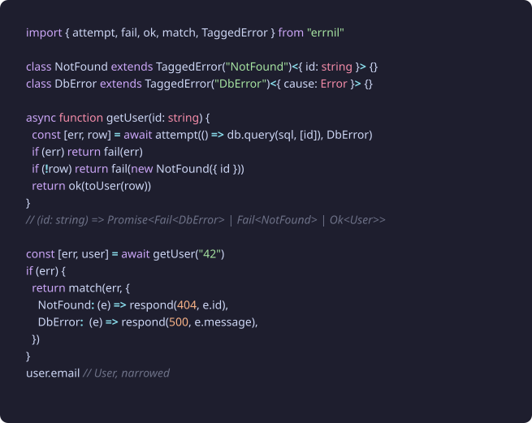
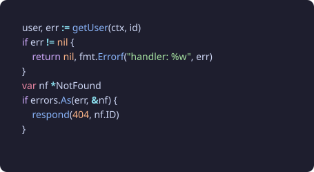
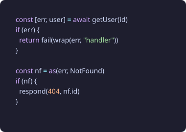
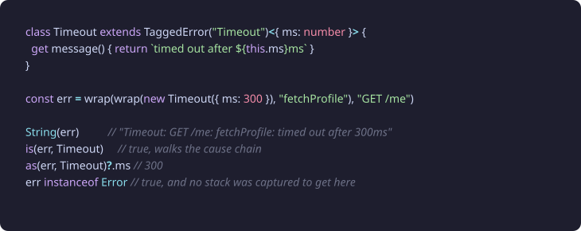
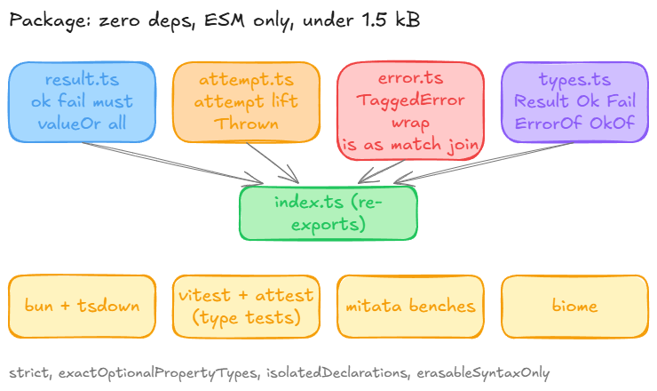

# errnil

`if err != nil`, for TypeScript.

Errors as values, the way Go does it, with the one thing Go cannot give you:
the compiler knows exactly which errors a function can return, and it makes
you handle every one of them.

```sh
npm install errnil
```

Zero dependencies. ESM. Node 20+, Bun, Deno, browsers, workers. 1.4 kB gzipped.

<p align="center">
  
</p>

## Why

I like Go's error handling. Not the boilerplate, the model: a function that can
fail says so in its signature, the caller looks at the error right there, and
nothing unwinds the stack behind your back. What I did not like was losing the
types. In Go every error is `error`. In TypeScript, with a bit of inference,
every error can be exactly what it is.

So the idea of errnil is small:

- A result is a plain tuple, `[err, value]`. No class, no `.map`, no `yield*`.
  You check `err`, and TypeScript narrows `value` for you.
- An error is a class you define in one line, with a literal `name` and typed
  fields, and it is a real `Error` at runtime.
- The only two places an exception can appear are `attempt` (catch one) and
  `must` (throw one). Everything in between is just values.
- The error union of a function is inferred from its `fail(...)` calls. No
  annotations, no wrapper types to thread through.

The result is code that reads like Go and typechecks like TypeScript.

<p align="center">
  
</p>

## Five minutes

Define errors. The tag becomes the literal `name`, the props become readonly
fields:

```ts
import { TaggedError } from "errnil"

class NotFound extends TaggedError("NotFound")<{ id: string }> {}
class Forbidden extends TaggedError("Forbidden")<{ reason: string }> {}
class DbError extends TaggedError("DbError")<{ cause: Error }> {}
```

Return them with `fail`, return values with `ok`. The union is inferred:

```ts
import { ok, fail, attempt } from "errnil"

async function getDocument(id: string, user: string) {
  const [err, row] = await attempt(() => db.query(sql, [id]), DbError)
  if (err) return fail(err)
  if (!row) return fail(new NotFound({ id }))
  if (row.owner !== user) return fail(new Forbidden({ reason: "not yours" }))
  return ok(row)
}
// Promise<Fail<DbError> | Fail<NotFound> | Fail<Forbidden> | Ok<Row>>
```

Check the error where you get it. After `if (err)` the value is narrowed and
the error is gone from scope:

```ts
const [err, doc] = await getDocument(id, user)
if (err) return fail(err)
doc.title
```

Handle it at the edge, exhaustively. Forget a case and it will not compile:

```ts
import { match } from "errnil"

return match(err, {
  NotFound: (e) => respond(404, `no document ${e.id}`),
  Forbidden: (e) => respond(403, e.reason),
  DbError: (e) => respond(503, e.cause.message),
})
```

That is most of the library.

<p align="center">
  
</p>

## Go, side by side

<table>
<tr>
<th>Go</th>
<th>errnil</th>
</tr>
<tr>
<td></td>
<td></td>
</tr>
</table>

| Go | errnil |
| --- | --- |
| `v, err := f()` | `const [err, v] = f()` |
| `if err != nil { return nil, err }` | `if (err) return fail(err)` |
| `fmt.Errorf("getUser: %w", err)` | `wrap(err, "getUser")` |
| `errors.Is(err, ErrNotFound)` | `is(err, NotFound)` |
| `errors.As(err, &target)` | `const target = as(err, NotFound)` |
| `errors.Join(a, b)` | `join([a, b])` |
| `type NotFound struct{ ID string }` | `class NotFound extends TaggedError("NotFound")<{ id: string }> {}` |
| `switch e := err.(type) {}` | `match(err, { NotFound: ..., DbError: ... })` |
| `panic(err)` | `must(result)` |
| `defer recover()` | `attempt(fn)` |
| `err := f()` | `const [err] = f()` |

The error goes first in the tuple, unlike Go. That is deliberate: a function
that only reports failure destructures as `const [err] = save()`, and there is
no position where the error can be silently dropped. If you want the Go order,
it is a two-line change in your own wrapper; everything else is order-agnostic.

## Errors that carry context

`wrap` adds one clause of context and keeps the error's type, prototype and
fields. The original is the `cause`. `is` and `as` walk the chain like Go's
`errors.Is` and `errors.As`, and `match` still works after wrapping because
the tag is unchanged.

<p align="center">
  
</p>

If you prefer Go's spelling there is an `errors` object with the same
functions: `errors.is(err, NotFound)`, `errors.wrap(err, "getUser")`.

<p align="center">
  
</p>

## The API

Everything is a named export. There are eleven functions.

| | |
| --- | --- |
| `ok(value)` / `ok()` | success, `Ok<T>` |
| `fail(error)` | failure, `Fail<E>`; `E` must be an object |
| `attempt(fn \| promise, mapper?)` | run something that may throw, get a result. The mapper is a function or a `TaggedError` class taking `{ cause }` |
| `must(result)` | value or throw |
| `valueOr(result, fallback)` | value or fallback (a value or a function of the error) |
| `all([r1, r2, ...])` | first failure, or a typed tuple of all values |
| `lift(fn)` | wrap a throwing function once instead of every call |
| `TaggedError(tag, { stack? })` | define an error class |
| `wrap(err, context)` | prefix the message, link the cause, keep the type |
| `is(err, ClassOrInstance)` / `as(err, Class)` | search the cause chain |
| `match(err, handlers)` | exhaustive dispatch on the tag |
| `join(errors)` | one error holding many |

Types: `Result<T, E>`, `Ok<T>`, `Fail<E>`, `AsyncResult<T, E>`,
`ErrorOf<typeof fn>`, `OkOf<typeof fn>`.

<p align="center">
  
</p>

## Things to know

**Use `const`.** TypeScript only correlates the two halves of a destructured
tuple for `const` bindings. `let [err, value] = ...` typechecks, but `value`
stays `T | undefined` after your `if (err)`. Same story if you destructure the
value in the same statement: `const [err, [a, b]] = all(...)` skips the
narrowing step. Take the tuple apart after the check.

**Errors are objects, always.** `fail("nope")` is a type error. Objects are
always truthy, which is what makes `if (err)` sound. The value side can be
anything, including `0`, `""` and `undefined`.

**No stack traces by default.** A `TaggedError` never runs the `Error`
constructor, so creating one costs about as much as an object literal instead
of a couple of microseconds. That is the point: domain errors are values and
you make a lot of them. Exceptions caught by `attempt` keep their own stack,
`must` captures one at the throw site, and `TaggedError("X", { stack: true })`
turns capture on for a class when you want it.

**`Error.isError()` says no.** Because the constructor never runs, the new
`Error.isError` and Node's `util.types.isNativeError` return `false` for
tagged errors, and `structuredClone` flattens them to plain objects. Use
`instanceof`, `NotFound.is(x)` or `is(err, NotFound)`. Logging is unaffected:
Node prints `NotFound { id: '42' }`, `JSON.stringify` gives you name, message,
fields and cause.

**`isolatedDeclarations`.** If you build your own library with that flag on,
TypeScript refuses `export class X extends TaggedError("X")<...> {}` because
the base is an expression (Effect's `Data.TaggedError` has the same limit).
Bind the base first: `const Base = TaggedError("X")` then
`export class X extends Base<...> {}`.

## Performance

Benchmarks live in `bench/` and run with `bun run bench` or `node bench/run.ts`.
They model real work rather than tight loops: a request handler that parses a
body, validates it and looks a record up, with 0%, 10% and 50% of requests
failing; an error born five calls deep and re-wrapped at each layer; the async
boundary. Averages from one run on a laptop, Bun 1.3.14 and Node 24.16.

Request handler, one iteration, nanoseconds (lower is better):

| failures | errnil | throw/catch | neverthrow | effect (runSync) | @superbuilders/errors |
| --- | --- | --- | --- | --- | --- |
| 0%, Bun | 160 | 145 | 164 | 1609 | 163 |
| 10%, Bun | 166 | 241 | 165 | 1660 | 325 |
| 50%, Bun | 159 | 596 | 159 | 1875 | 903 |
| 0%, Node | 225 | 203 | 220 | 1632 | 223 |
| 10%, Node | 224 | 689 | 211 | 2135 | 995 |
| 50%, Node | 232 | 2592 | 204 | 4004 | 4128 |

Creating one domain error:

| | Bun | Node |
| --- | --- | --- |
| errnil `new NotFound({ id })` | 17 | 24 |
| plain object literal | 7 | 19 |
| `new Error` subclass | 398 | 1930 |
| effect `Data.TaggedError` | 488 | 2881 |
| `@superbuilders/errors.new` | 729 | 4009 |

The honest parts: at 0% failures throw/catch is a few percent faster, because
the happy path of a `try` block costs nothing and a tuple costs one small
allocation. `attempt(promise)` adds about 60 to 90 ns to a raw `try { await }`
for the extra promise it settles through. neverthrow is just as fast as errnil
on the handler scenario and faster on deep propagation when most calls fail,
because `wrap` builds a message string per layer and `mapErr` does not. Effect
is doing a lot more than error handling and is priced accordingly.

<p align="center">
  
</p>

## Prior art

neverthrow if you want a chainable Result with combinators. Effect if you want
a whole runtime. `@superbuilders/errors` if you want Go's `errors` package
but are fine with throwing. errnil sits in the gap: tuple results, inferred
error unions, exhaustive matching, and Go's chain-walking helpers, in a
package small enough to read in one sitting.

## License

MIT
