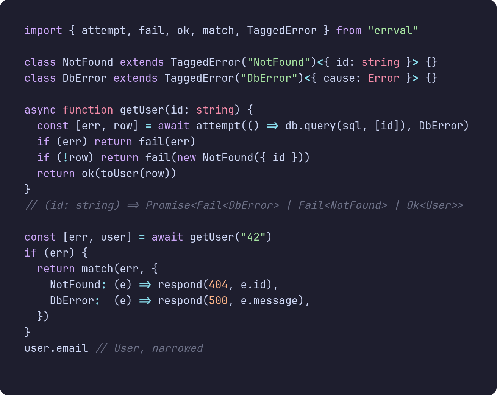
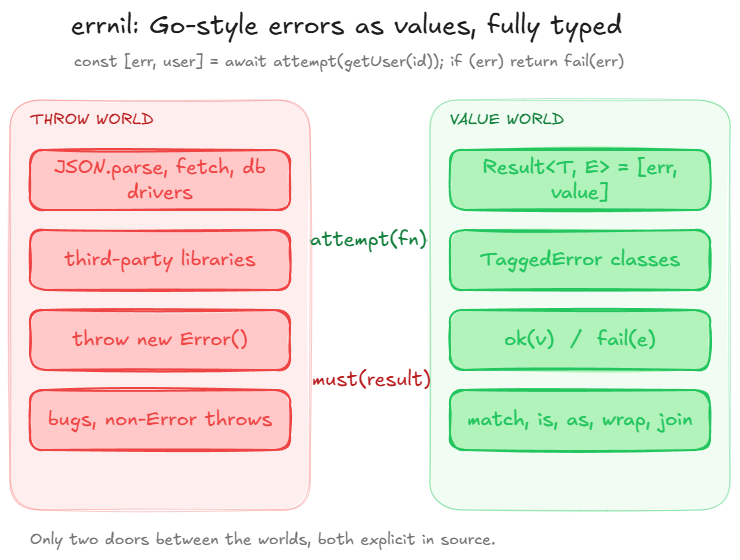
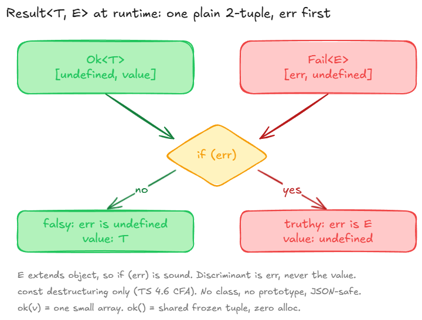
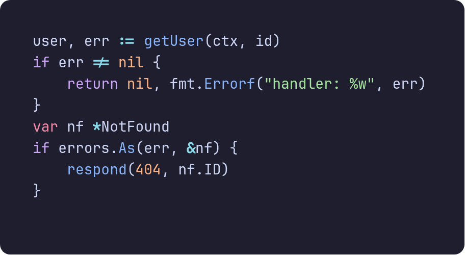
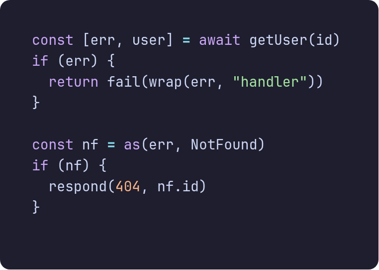
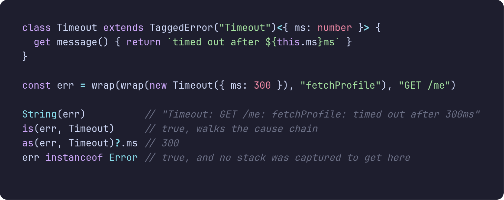
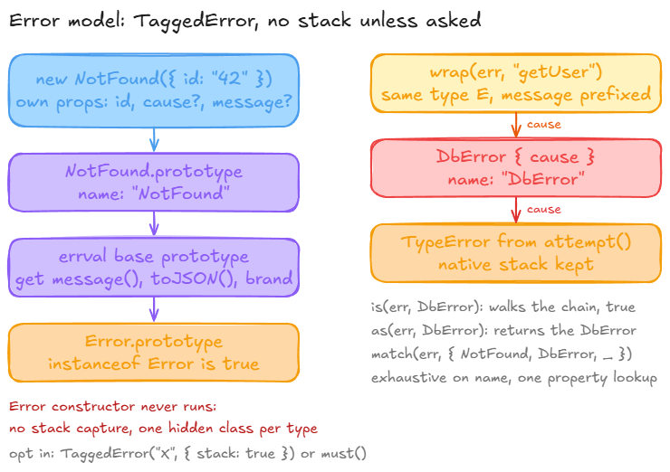
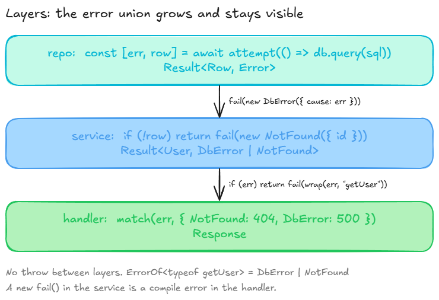

# errval

Errors as values, the Go way, with the types Go never had.

Errors as values, the way Go does it, with the one thing Go cannot give you:
the compiler knows exactly which errors a function can return, and it makes
you handle every one of them.

```sh
npm install errval
```

Zero dependencies. ESM. Node 20+, Bun, Deno, browsers, workers. 1.4 kB gzipped.

<p align="center">
  
</p>

## Why

I like Go's error handling. Not the boilerplate, the model: a function that can
fail says so in its signature, the caller looks at the error right there, and
nothing unwinds the stack behind your back. What I did not like was losing the
types. In Go every error is `error`. In TypeScript, with a bit of inference,
every error can be exactly what it is.

So the idea of errval is small:

- A result is a plain tuple, `[err, value]`. No class, no `.map`, no `yield*`.
  You check `err`, and TypeScript narrows `value` for you.
- An error is a class you define in one line, with a literal `name` and typed
  fields, and it is a real `Error` at runtime.
- The only two places an exception can appear are `attempt` (catch one) and
  `must` (throw one). Everything in between is just values.
- The error union of a function is inferred from its `fail(...)` calls. No
  annotations, no wrapper types to thread through.

The result is code that reads like Go and typechecks like TypeScript.

<p align="center">
  
</p>

## Five minutes

Define errors. The tag becomes the literal `name`, the props become readonly
fields:

```ts
import { TaggedError } from "errval"

class NotFound extends TaggedError("NotFound")<{ id: string }> {}
class Forbidden extends TaggedError("Forbidden")<{ reason: string }> {}
class DbError extends TaggedError("DbError")<{ cause: Error }> {}
```

Return them with `fail`, return values with `ok`. The union is inferred:

```ts
import { ok, fail, attempt } from "errval"

async function getDocument(id: string, user: string) {
  const [err, row] = await attempt(() => db.query(sql, [id]), DbError)
  if (err) return fail(err)
  if (!row) return fail(new NotFound({ id }))
  if (row.owner !== user) return fail(new Forbidden({ reason: "not yours" }))
  return ok(row)
}
// Promise<Fail<DbError> | Fail<NotFound> | Fail<Forbidden> | Ok<Row>>
```

Check the error where you get it. After `if (err)` the value is narrowed and
the error is gone from scope:

```ts
const [err, doc] = await getDocument(id, user)
if (err) return fail(err)
doc.title
```

Handle it at the edge, exhaustively. Forget a case and it will not compile:

```ts
import { match } from "errval"

return match(err, {
  NotFound: (e) => respond(404, `no document ${e.id}`),
  Forbidden: (e) => respond(403, e.reason),
  DbError: (e) => respond(503, e.cause.message),
})
```

That is most of the library.

<p align="center">
  
</p>

## Go, side by side

<table>
<tr>
<th>Go</th>
<th>errval</th>
</tr>
<tr>
<td></td>
<td></td>
</tr>
</table>

| Go | errval |
| --- | --- |
| `v, err := f()` | `const [err, v] = f()` |
| `if err != nil { return nil, err }` | `if (err) return fail(err)` |
| `fmt.Errorf("getUser: %w", err)` | `wrap(err, "getUser")` |
| `errors.Is(err, ErrNotFound)` | `is(err, NotFound)` |
| `errors.As(err, &target)` | `const target = as(err, NotFound)` |
| `errors.Join(a, b)` | `join([a, b])` |
| `type NotFound struct{ ID string }` | `class NotFound extends TaggedError("NotFound")<{ id: string }> {}` |
| `switch e := err.(type) {}` | `match(err, { NotFound: ..., DbError: ... })` |
| `panic(err)` | `must(result)` |
| `defer recover()` | `attempt(fn)` |
| `err := f()` | `const [err] = f()` |

The error goes first in the tuple, unlike Go. That is deliberate: a function
that only reports failure destructures as `const [err] = save()`, and there is
no position where the error can be silently dropped. If you want the Go order,
it is a two-line change in your own wrapper; everything else is order-agnostic.

## Errors that carry context

`wrap` adds one clause of context and keeps the error's type, prototype and
fields. The original is the `cause`. `is` and `as` walk the chain like Go's
`errors.Is` and `errors.As`, and `match` still works after wrapping because
the tag is unchanged.

<p align="center">
  
</p>

If you prefer Go's spelling there is an `errors` object with the same
functions: `errors.is(err, NotFound)`, `errors.wrap(err, "getUser")`.

<p align="center">
  
</p>

## The API

Everything is a named export. There are eleven functions.

| | |
| --- | --- |
| `ok(value)` / `ok()` | success, `Ok<T>` |
| `fail(error)` | failure, `Fail<E>`; `E` must be an object |
| `attempt(fn \| promise, mapper?)` | run something that may throw, get a result. The mapper is a function or a `TaggedError` class taking `{ cause }` |
| `must(result)` | value or throw |
| `valueOr(result, fallback)` | value or fallback (a value or a function of the error) |
| `all([r1, r2, ...])` | first failure, or a typed tuple of all values |
| `lift(fn)` | wrap a throwing function once instead of every call |
| `TaggedError(tag, { stack?, native? })` | define an error class; each class gets `is(x)` and `parse(json)` |
| `wrap(err, context)` | prefix the message, link the cause, keep the type |
| `is(err, ClassOrInstance)` / `as(err, Class)` | search the cause chain |
| `match(err, handlers)` | exhaustive dispatch on the tag |
| `join(errors)` | one error holding many |

Types: `Result<T, E>`, `Ok<T>`, `Fail<E>`, `AsyncResult<T, E>`,
`ErrorOf<typeof fn>`, `OkOf<typeof fn>`.

<p align="center">
  
</p>

## Things to know

**Use `const`.** TypeScript only correlates the two halves of a destructured
tuple for `const` bindings. `let [err, value] = ...` typechecks, but `value`
stays `T | undefined` after your `if (err)`. Destructuring the value in the
same statement, `const [err, [a, b]] = all(...)`, is rejected outright
(TS2488, the value may be `undefined` at that point); take the tuple apart
after the check.

**Errors are objects, always.** `fail("nope")` is a type error. Objects are
always truthy, which is what makes `if (err)` sound. The value side can be
anything, including `0`, `""` and `undefined`.

**No stack traces by default.** A `TaggedError` never runs the `Error`
constructor, so creating one costs about as much as an object literal instead
of a couple of microseconds. That is the point: domain errors are values and
you make a lot of them. Exceptions caught by `attempt` keep their own stack,
`must` captures one at the throw site, and `TaggedError("X", { stack: true })`
turns capture on for a class when you want it.

**`Error.isError()` says no, unless you ask.** Because the constructor never
runs, the new `Error.isError` and Node's `util.types.isNativeError` return
`false` for tagged errors. `instanceof`, `NotFound.is(x)` and `is(err, X)`
all work, Node logs them as errors, and `JSON.stringify` gives you name,
message, fields and cause. If something in your stack insists on the native
slot, `TaggedError("X", { native: true })` constructs through the real `Error`
constructor with stack capture suppressed: about 165 ns per error on Node and
300 ns on Bun instead of 15 to 25, still well under a plain `new Error`.
`structuredClone` and `postMessage` keep only what the platform serialises
(message, cause) whichever way you construct; `NotFound.parse(value)` revives
one from JSON or a clone.

**Bun's `console.log`.** Bun formats only native-slot objects as errors, so
errval installs a `Bun.inspect.custom` hook on Bun (and only there) that
prints `[NotFound: message] { id: '42' }` with the cause. Node keeps its own
formatting.

**`isolatedDeclarations`.** With that flag on, TypeScript refuses any
expression in an `extends` clause (TS9021), so an exported
`class X extends TaggedError("X")<...>` will not compile; Effect's
`Data.TaggedError` has the same limit. Bind and annotate the base, then extend
the identifier:

```ts
import { TaggedError, type TaggedErrorClass } from "errval"

const Base: TaggedErrorClass<"NotFound"> = TaggedError("NotFound")
export class NotFound extends Base<{ id: string }> {}
```

## Performance

Benchmarks live in `bench/` and run with `bun run bench` or `node bench/run.ts`.
They model real work rather than tight loops: a request handler that parses a
body, validates it and looks a record up, with 0%, 10% and 50% of requests
failing; a form validator that reports every bad field; an error born five
calls deep and re-wrapped at each layer; the async boundary. Averages from one
run on a laptop, Bun 1.3.14 and Node 24.16, nanoseconds per iteration, lower
is better.

Request handler (parse, validate, look up, respond):

| failures | errval | throw/catch | neverthrow | effect (runSync) | @superbuilders/errors |
| --- | --- | --- | --- | --- | --- |
| 0%, Bun | 156 | 140 | 155 | 1484 | 151 |
| 10%, Bun | 161 | 232 | 156 | 1705 | 303 |
| 50%, Bun | 163 | 599 | 157 | 1762 | 869 |
| 0%, Node | 203 | 195 | 210 | 1665 | 212 |
| 10%, Node | 219 | 748 | 204 | 2065 | 997 |
| 50%, Node | 226 | 2623 | 198 | 3952 | 4061 |

Validating a ten-field form and reporting every invalid field:

| invalid fields | errval | throw AggregateError | neverthrow (plain objects) | effect Data.TaggedError | @superbuilders/errors |
| --- | --- | --- | --- | --- | --- |
| 0, Bun | 121 | 117 | 111 | 108 | 116 |
| 2, Bun | 225 | 1876 | 124 | 1357 | 2944 |
| 5, Bun | 305 | 3128 | 113 | 2915 | 5334 |
| 0, Node | 62 | 68 | 66 | 65 | 62 |
| 2, Node | 309 | 13189 | 79 | 10769 | 24200 |
| 5, Node | 428 | 26277 | 91 | 26774 | 49690 |

Creating one domain error:

| | Bun | Node |
| --- | --- | --- |
| errval `new NotFound({ id })` | 15 | 25 |
| plain object literal | 7 | 19 |
| `new Error` subclass | 437 | 1978 |
| effect `Data.TaggedError` | 516 | 2908 |
| `@superbuilders/errors.new` | 886 | 4090 |

Five layers deep, one `wrap` per layer on the way out:

| failures | errval | throw/catch (rethrow with cause) | neverthrow (map/mapErr) |
| --- | --- | --- | --- |
| 0%, Bun | 46 | 14 | 64 |
| 50%, Bun | 129 | 2851 | 145 |
| 0%, Node | 37 | 14 | 21 |
| 50%, Node | 260 | 16564 | 152 |

Awaiting one promise through the boundary:

| rejections | errval `attempt` | raw `try { await }` | neverthrow `ResultAsync` | @superbuilders/errors.try |
| --- | --- | --- | --- | --- |
| 0%, Bun | 178 | 115 | 337 | 190 |
| 50%, Bun | 458 | 541 | 625 | 656 |
| 0%, Node | 135 | 83 | 233 | 132 |
| 50%, Node | 1808 | 1756 | 1908 | 1832 |

The honest parts. On the all-success path throw/catch is a few percent faster:
a `try` block that never throws costs nothing, and a tuple costs one small
allocation. `attempt(promise)` is one extra promise, about 50 ns, over a raw
`try { await }`. neverthrow with plain object errors beats errval on the
validation and Node propagation rows because those objects carry no name and
no message; errval errors are real `Error`-compatible objects with both, and
`wrap` builds a message string per layer. Once anything on the other side
calls `new Error`, and that includes Effect's `Data.TaggedError` and every
throw-based library, errval is 10x to 100x ahead, and the gap grows with the
failure rate. The numbers you should care about are the ones that match your
failure rate.

## Prior art

neverthrow if you want a chainable Result with combinators. Effect if you want
a whole runtime. `@superbuilders/errors` if you want Go's `errors` package
but are fine with throwing. errval sits in the gap: tuple results, inferred
error unions, exhaustive matching, and Go's chain-walking helpers, in a
package small enough to read in one sitting.

## License

MIT
